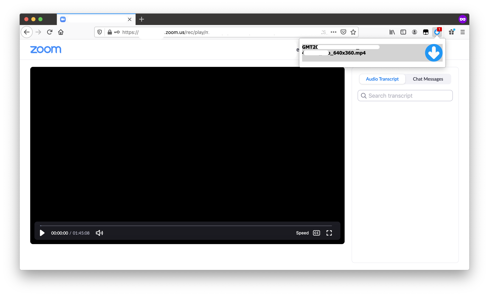

# Zoom Recording Downloader

Project link: https://github.com/lewisxy/zoom-recording-downloader/

-----
## Update 4/16/2021
We found an alternative method to download zoom recordings using the browser's builtin video download functionality. 
 - Firefox: Hold SHIFT and right click the video, click on "Save Video As..." (no plugin needed).
 - Chrome: Find a plugin that bypass right click restriction (for example, [this plugin](https://chrome.google.com/webstore/detail/allow-right-click/hompjdfbfmmmgflfjdlnkohcplmboaeo)), and then right click the video, click on "Save Video As..."

Enjoy!

-----

Download zoom cloud recordings to your computer.
This extension will download videos from pages matching
> https://<company_name>.zoom.us/rec/play/...

## Usage
When download is available, there will be a number showed
up on the icon of this extension on the tool bar. Click
on the one you want to download. You have to open the
above mentioned url at least once for this extension to
detect the download.

## Technical details
If you are interested in how this extension works, please
continue reading.

### Overview
This extension use `webRequest` API to record the request made by
the media player, and replay it to download the video file.

### Why can't you download using user script?
### Why do you have to use `webRequest` API?
While you can easily find the video url using JavaScript,
both correct cookie and correct `Referer` header is required
to download the video. 
Browser won't let you to set `Referer` header freely (in
case you want to download it directly), and
won't let the user script access the `httpOnly` cookie 
(in case you want to use a proxy to override the http 
header).

For this reason, I don't know any proper way to download
from the browser other than modifying the request (with
`webRequest` API). If you can accomplish it using only
user script, I am willing to learn from you.

### Why only Firefox?
### Will there be an extension for Chrome?
Short answer, no. Although all the APIs are available for
Chrome with little modifications. There is no way to modify
`Referer` header with `webRequest` API and even if `extraHeaders`
is enabled (tested on Chrome 86).

If you have to download from Chrome, and have `curl` installed
on you computer, you can go to the network tab in developer tools.
Find the request for the media file, and use the "copy as cURL"
option in the right click menu. Then paste it in your command line.

# License
MIT

Icon made by Pixel perfect from www.flaticon.com
